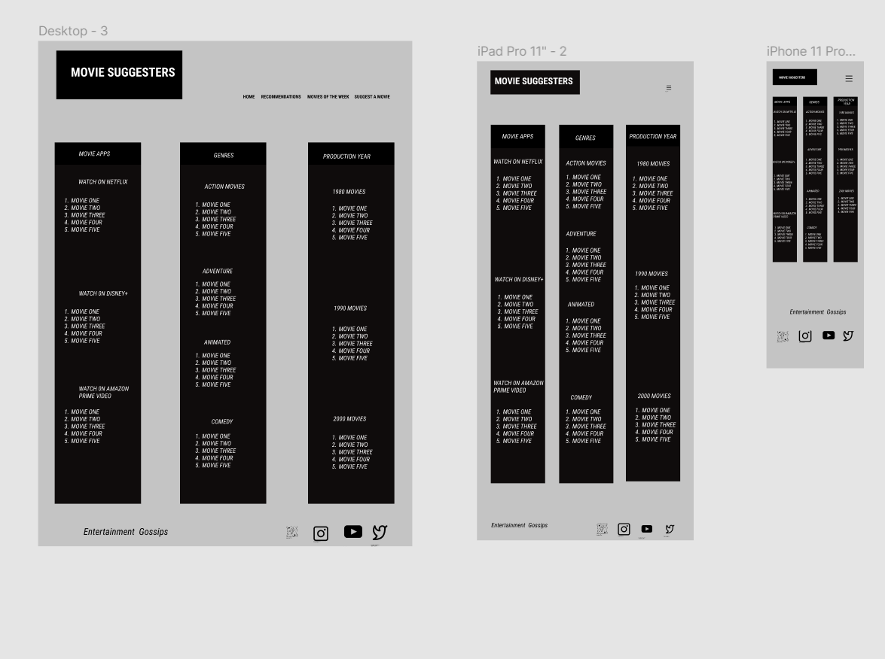

# MILESTONE PROJECT ONE
### MOVIE SUGGESTERS


## TABLE OF CONTENT
1. [Title](#Title)
2. [Introduction](#Introduction)
3. [User Experience](#User-Experience)
    * [Project Goals](#Project-Goals)
    * [Users' Goals](#Users'-Goals)
    * [Developer's Goals](#Developer's-Goals)
    * [First time user Goals](#First-time-user-Goals)
    * [Returning Visitor Goals](#Returning-Visitor-Goals)
4. [Development Planes](#Development-Planes)
5. [Design Choices](#Design-Choices)
6. [Technologies Used](#Technologies-Used)
7. [Features](#Features)
    * [Design Features](#Design-Features)
    * [Existing Features](#Existing-Features)
    * [Features to Implement in the future](#Features-to-Implement-in-the-future)
8. [Testing](#Testing)
    * [Testing User Stories from User Experience (UX) Section](#Testing-User-Stories-from-User-Experience-(UX)-Section)
    * [Further Testing](#Further-Testing)
    * [Browser Validation](#Browser-Validation)
    * [Lighthouse Auditing](#Lighthouse-Auditing)
9. [Issues and Bugs](#Issues-and-Bugs)
10. [Deployment](#Deployment) 
11. [Deploying on GitHub Pages](#Deploying-on-GitHub-Pages)
12. [Forking the Repository](#Forking-the-Repository)
13. [Creating a Clone](#Creating-a-Clone)
14. [Credits](#Credits)

## Title
 Movie Suggesters

## Introduction
 Movie suggesters is a website designed to recommend movies for movie lovers and suggest where it can be watched. It also enables users to recommend movies that they think is worth watching for others.

## User Experience


### Project Goals
 The aim of creating this website is to make it easier for movie lovers to see recommended movies and make the choice of what to watch and where by picking movies that are suggested as worth-watching movies by other movie lovers.

#### Users' Goals
1. To see suggested movies in a less distracting site.
2. To read and know something about the suggested movie in order to decide if it's worth watching.
3. To recommend movies for others.
4. To be able to see movies arranged and grouped.

#### Developer's Goals
1. To make a website where movie lovers can see some suggested movies and not waste time searching through hundreds of movies without knowing which is worth watching.
2. To logically group the movies based on where to watch and the category of the movie.
3. To minimize dissapointment of blindly watching a movie on a movie App that can later be said to be a waste of time and effort.
4. To give users the opportunity to recommend movies that they have seen and would love others to see as well.
5. To make users feel as part of the website community by giving them the opportunity to recommend movies for others to watch.   

### First time user Goals
* As a first time user, I want to be able to understand the purpose of the website at a glance.
* As a first time user, I want to be able to navigate through the site with ease.
* As a first time user, I want to be able to make recommendations easily without typing too much.
* I want to be able to contact or follow the site owner on social media for any questions or update. 

### Returning Visitor Goals
* As a returning user, I want to be able to see new movie suggestions weekly on site.
* I want to be able to recommend movies and be able to ask how my recommendations are used.
* As a returning user, I want to be able to watch suggested movies of the week trailers

## Development Planes
- The site was designed by the developer and was inspired by developers experience and interaction with friends in finding it difficult to pick a movie that is worth watching on Movie Apps because there are hundreds of movies to pick from and cannot know which one to pick. The site was created having in mind users experience on other sites and meeting their needs. 


### Strategy
- The website will focus on the following
    * New movie lovers
    * Existing movie lovers
    * Age 18 and above
    * Mostly UK/EU based users though not limited

- The website needs **users** to be able to:
    * See recommended movies grouped in a selected class
    * Recommend movies to others
    * Watch movie trailers
    * See entertainment news

- The website needs the **developer** to be able to:
    * Upload movie trailers weekly
    * Collect recommended movies by users
    * Filter the recommendation page regularly using users recommendations


### Scope
A scope was defined in order to clearly identify what needed to be done in order to align features with the strategy previously defined.
- **Content Requirements**
     - The user will be looking for:
          - Grouped recommended movies
          - Movie trailers
          - Recommend movie to watch
          - Entertainment news
          - Social Links
        
- **Functionality Requirements**
     - The user will be able to:
          - Easily navigate through the site in order to find the information they want
          - Be able to find links to external sites in order to:
               - To watch recommended movies
               - To read entertainment news

### Structure
- The site was carefully and logically designed and arranged in a tree that enables users to navigate through the site with ease.

### Skeleton
- Wireframe was created using [Figma](https://www.figma.com/file/xNpRfVbEvIAkqscHt548B1/Movie-Suggesters?node-id=0%3A1) having in mind the users needs to be met.

##### Homepage Wireframe


##### Recommendation page wireframe


##### Movies of the week Wireframe


##### Suggest a movie page Wireframe

               

 ## Design Choices
 - The site is made for movie lovers to easily see few suggested movies that can be watch at their leisure time. The design choice is made putting in mind that a movie settings is expected to be cool.

 **Background-colours:**
* Background colors are choosen to be dark and cool to give the users a welcomimg cinematic feel that also feels calm and relaxing setting the mode for some movie time.
 
 **Font:**
* The fonts used are Roboto and Satisfy to give the site artistic feel and also balancing it up to ensure it's legible and easy to read. The font-weight and sizes also ensures users are able to read contents easily.

 **Styling:**
* Most Boxes and containers have round edges which make them more attractive and eye catching without distracting attention from the main content.

 **Video files:**
* Videos were given controls to enable users to play, pause and mute the video if needed with little description added to card.

 **Form:**
* Form was designed with a transparent container on a pictorial background to make it attractive and interesting to use. In order to enable users to use it witout stress and wasting time as well, it was designed to type less and check/click more thus saving time.

 **Icons:**
* All icons used are straight forward and not in any way misleading or confusing.       
 

## Technologies Used

### Languages Used
1. HTML5
2. CSS3

### Frameworks, Libraries & Programs Used
1. [Bootstrap 4.6.x](https://getbootstrap.com/docs/4.6/getting-started/introduction/):
    Bootstrap was used for responsiveness of the site and some advanced coding.

2. Hover.css:
 Hover.css was used on Social media footer icon to have a transition effect when hovered over.

3. [Font Awesome](https://fontawesome.com/):
    Font awesome was used to import icons used for social media on all pages.

4. [Google Fonts](https://fonts.google.com/):
    Google Fonts was used to import "Roboto and Satisfy" font family into style.css which were used throughout the project.     

5. [Javascript](https://getbootstrap.com/docs/4.6/getting-started/javascript/):
    Javascript was used as part of Bootstrap to make Navbar toogler used on all pages as well as scrollspy used on recommendations pages.

6. [Git](https://gitpod.io/workspaces):
    Git was used for version control to push and commit to Github.

7. [GitHub](https://github.com/):
    GitHub is used to store the project code.

8. [Tinypng](https://tinypng.com/):
    Tinypng was used to compress images used throughout the project.

9. [Pexels](https://www.pexels.com/):
    Free and high resolution images downloaded from the site were used in the project.

10. Wiki:
    Other images used in the project were from wiki site with sources referenced in the project. (Because of the quantity, sources could not be provided here).              

11. [HD-trailers](http://www.hd-trailers.net/):
    All videos used in the project were downloaded from the above site free.
    
12. Figma:
    Figma was used to create Wifeframes for the project. See here:
* [Homepage Wireframe](https://www.figma.com/file/8BlnyDyJlrUp4Q340kZx5D/Home-Page?node-id=0%3A1)
* [Recommendations page Wireframe](https://www.figma.com/file/zW4lBzVaeicYauV5non2aj/Recommendation-page?node-id=0%3A1)
* [Movies of the week Wireframe](https://www.figma.com/file/j3KvF6XbDaCBKP6VMacxzL/Movies-of-the-week?node-id=0%3A1)
* [Form Wireframe](https://www.figma.com/file/nNciNsMGEe0kidD0gCGEQm/Form?node-id=0%3A1)


## Features

### Design Features
Each page of the website features a consistent responsive navigational system:
- The **Header** contains a neatly placed **logo** in the top left side of all pages and the logo when clicked redirect users to home page. On the top right side just on the same plain with the logo(text) is the **navigation bar** which appears as a button on smaller screens and spreads out right next to the logo in bigger screens.
- One of the **navigation links** has a dropdown that only appears when clicked and each leads to another page.
- On the recommendation page which is a long page, sets of links to other sections of the same page was provided to allow users navigate through different sections of the page with ease.
- There is a **Footer** that contains the appropriate **social media icons** linking users to the social media that each represents but not anyone's media page. It also contains a link to entertainment news page. 

<dl>
  <dt><a href="index.html" target="_blank" alt="Movie Suggesters Home Page">Home Page</a></dt>
  <dd>The Home page section appears same on all devices with the text above and the Call to action button below it.
     <ul>
          <li><strong>Background image</strong> - The background image was set to be 100% of the viewing port to captivate users. The image was chosen as it represents a good and calm outdoor cinema that speaks to users even before checking the contents. The Image does not shrink or stretch on all devices.
          </li>
          <li><strong>Recommend Container</strong> - Nicely placed below the description text on the Home page with a transparent box over the background image. This was designed to increase and encourage users to recommend movies since it is the first page to be seen upon opening site. In this, there is a <strong>call to action</strong> button linking the <strong>suggest a movie page</strong> where users can fill out the form to recommend movies.
          </li>
     </ul>
  </dd>

  <dt><a href="movie-app.html" target="_blank" alt="Movie App Page">Movie App Page</a></dt>
  <dd>The movie app page is one of the three sub pages of recommendation page, the other two which are <strong>Genres and Production year</strong>have similar set-up and design. It is designed recommending movies to users based on the App where it can be watched.  
     <ul>
          <li><strong>Images</strong> - On a small screen the images(Movie Posters) are set to be stacked above the text. On a larger screen however, they appear taking 1/3rd of the page nicely placed on the left side of the screen
          </li>
          <li><strong>Card text</strong> - Card texts is the section that contains description of the images and a small link. On small screens, the texts appear below the images they are describing. On larger screens, they occupy the remaining 2/3rd of the page appearing on the right side of the images. 
          </li>
          <li><strong>Navigation links</strong> - On movie app page is a set of links that is set to appear at the middle of the page, it contains links that leads to other sections of the same page since it's a long page. The links have a border color similar to the Headings of the sections to maintain the continuity on the page. The links are stacked on each other at the center of the page on a small screen and spreads out as the screen widens.
          </li>
     </ul>
  </dd>

  <dt><a href="movies.html" target="_blank" alt="Movies of the Week Page">Movies of the Week Page</a></dt>
  <dd>The page has similar Header and footer as with other pages.
     <ul> 
          <li><strong>Background Image</strong> - The background image was set to have a height of 100% and a slightly dark image was chosen to set the cinematic atmosphere. The image appears the same on all screens
          </li>
          <li><strong>Videos</strong> - The videos was set to be centrally placed at the top of the text in all screens. It has control that allows users to play, pause and control the volume. It was set to take 60% of view port thereby allowing it to adjust on all screens without looking streched.
          </li>
          <li><strong>Video texts</strong> - Underneath the video is a text with the details of the video. It appears underneath the video on all screens
          </li>
          </ul>
     </ul>

  </dd>

  <dt><a href="suggest-a-movie.html" target="_blank" alt="Suggest a Movie Page">Suggest a Movie</a></dt>
  <dd> The form appears the same on all pages with the box smaller on small screens and wider on larger screens.
   <ul> 
          <li><strong>Background Image</strong> - The background image is set to be 100% as other background images. It is the same as the Home page background image putting in mind that the two pages are linked. The call to action button on the Home page leads to this page and the idea of making it similar is to give users the feel that they are still in the same place performing different action
          </li>
          <li><strong>Form Container</strong> - The container was set to be transparently fitted on the home page. It appears smaller on smaller screen but slightly higher on bigger screens.
          </li>
          <li><strong>Form fields</strong> - The fields on the form aside one were all made required and it also allows users to just click aside the first field. This click options is to encourage users to use the form and not waste time on it. It has a submit button at the end which refreshes the page when clicked.
          </li>
          </ul>
  </dd>
  
</dl>

 
### Existing Features
- **Header Logo** - There is a logo that appears on all pages. Clicking the logo will return the users to the home page.
- **Header Navigation Bar** - This also appears on all pages to enable users to easily navigate through the pages on the site.
- **Social Icons and Entertainment link** - This appears at the foot of all pages. The social media icons do not open and are not linked to anybody's social media page but will however take the users to the social media page where they can login. The Entertainment Gossip link when clicked takes the user to another tab with entertainment daily news(This entertainment news site is not owned by the developer).
- **Dropdown recommendation link** - This appears as Recommendations link with a little arrow signifying dropdown items. When clicked, the dropdowm items appear and they can be clicked to link user to the pages clicked. It has 3 dropdown items which are <strong>Movie Apps, Genres and Production year</strong>.
- **Suggest a movie form** - This is a form that enables users to recommend movies. The fields are simple to use and quick.

### Features to Implement in the future
- **Movie trailers for recommended movies**
     - **Feature** - The images on recommended page will have the movie poster which will flip to display trailers of the same movie when clicked.
     - **Reason for not featuring in this release** - JavaScript needed to successfully embed videos and make it stop once the card is closed.
 
 - **Community page**
     - **Feature** - This allows frequent users to see specific movies recommended by other users.
     - **Reason for not featuring in this release** - Time factor.

 - **More Movie Apps**
     - **Feature** - This will include more movie apps in the Movie apps pages as the present is limited.
     - **Reason for not featuring in this release** - Other movie apps the developer wanted to include are not available in developer's region at the time of developing the site.

## Testing

* W3C Markup Validation Service
* W3C CSS Validation Service
    - The W3C Markup Validator and W3C CSS Validator Services were used to validate every page of the project to ensure there were no syntax errors in the project.
 
### CSS Validation


### Home page html validation


### Recommendation page validation


## Testing User Stories from User Experience (UX) Section
### First time visitor goals
1. As a first time user, I want to be able to understand the purpose of the website at a glance.
    * Upon opening the site, the user is welcomed by a captivating background image which is an outdoor cinema with  heading plain on the image telling first time users what we do.
    * On the Navigation bar are lists of instructions telling the user what each pages will do once clicked.
    * Also on the background that user will see first is a box telling users to make recommendations with a call to action button
    * At the foot of the page are social media links with icons ease in once hover over to captivate users.

2. As a first time user, I want to be able to navigate through the site with ease.
    * On the top of the page upon entry are links that directly inform users what each pages do and contents that might be found in them.
    * The Navigation bar is fixed thereby making it easier for users to see the links at all times and not feel trapped and the need to scroll all through to the top before they can leave current page.
    * On the recommendation page which is a long page, smaller links is made available at start of each section just making users a click away from other sections. 
    * The foot of the page has links that takes the user outside the tab they are working and this is made so users can return to the site without having to search again.

3. As a first time user, I want to be able to make recommendations easily without typing too much.
    * Upon entry, there is a call to action button visibly placed on the background image asking users to make recommendations. This button leads to a page where there is a form to be filled.
    * The form is designed to make it easier for users to recommend easily by just typing in one field and clicking to fill others.
    * After filling the required field in the form and the submit button is clicked, the page is refreshed and the user can use the navigation links to go to any other desired page.

4. I want to be able to contact or follow the site owner on social media for any questions or update.
    * At the foot of all pages is a list of social media icons that lead the user to the social media page of the site. However because the site is not real, the links do not lead to the site's social media pages as at this time.

### Returning Visitor Goals
1. As a returning user, I want to be able to see new movie suggestions weekly on site.
    * On returning to the page, the user can go to the movies of the week page by clicking on the navigation link and it will take the user to the weekly edited page of the website.

2. I want to be able to recommend movies and be able to ask how my recommendations are used.
    * The home page has a little captivating box which asks users if they would love to recommend a movie. This is visibly and neatly placed on the home page and the same button when clicked leads to a form for recommendation.
    * On every page is a link that users can click to display a recommendation form to suggest movies for others. The form is made simply, easy and quick to fill.

3. As a returning user, I want to be able to watch suggested movies of the week trailers.
    * On all pages is a link that leads users to the page where suggested movies for that week are.
    * Each movie trailers have controls that enables users to play and pause the movie trailers. 

## Further Testing
 * The website was tested on Google Chrome, Microsoft Edge, Opera, Internet Explorer and Safari Browsers
 * The website was tested on all browsers using different devices; Laptop, Tablets, Androids(Samsung S10+, Samsung S20), iphone7 and iPhoneX.
 * Friends and families were asked to check the website on various devices with different browsers to ensure all links are functioning well.

 
### Browser Validation
#### Chrome Browser


#### Microsoft Edge


#### Opera Browser


#### Firefox Browser


#### Internet Browser


### Lighthouse Auditing
### Recommended changes by Lighthouse could not be effected as at the time this project was submitted, it will be looked into in the future.

#### Home page lighthouse


#### Recommendation Page lighthouse


#### Movies of the week Page lighthouse


#### Suggest Page lighthouse


## Issues and Bugs

**Background-image bug** - While testing the site with different browsers, Internet Explorer couldn't load all background images. In researching the cause online and using the Dev tools, the developer discovered that setting the backgroundd image this way{html:background-image} was making images to not respond and same was changed.

**Footer bug** - The footer whenever the orientation of the device is changed was overlapping the contents in section. A mini project done in Bootstrap in Code Institute course(Rosie-s-resume) was revised and steps followed to solve the bug

**Suggest a movie form** - Select option(Second field on the form)could not be made a required field. In researching, a Bootstrap components was found and used to resolve the issue.

**Recommendation page bug** - The recommendation page was made to have dropdown using Bootstrap component. When clicked it displays the dropdown and the recommendation link itself does not lead to the linked page. After researching, the developer could write a code to overrule Bootstraps.

## Deployment

### Deploying on GitHub Pages
To deploy this page to GitHub Pages from its GitHub repository, the following steps were taken:

1. Log into [GitHub](https://github.com/login "Link to GitHub login page") or [create an account](https://github.com/join "Link to GitHub create account page").
2. Locate the [GitHub Repository](https://github.com/rebeccatraceyt/KryanLive "Link to GitHub Repo").
3. At the top of the repository, select Settings from the menu items.
4. Scroll down the Settings page to the "GitHub Pages" section.
5. Under "Source" click the drop-down menu labelled "None" and select "Master Branch".
6. Upon selection, the page will automatically refresh meaning that the website is now deployed.
7. Scroll back down to the "GitHub Pages" section to retrieve the deployed link.


### Forking the Repository
By forking the GitHub Repository we make a copy of the original repository on our GitHub account to view and/or make changes without affecting the original repository by using the following steps...

1. Log into [GitHub](https://github.com/login "Link to GitHub login page") or [create an account](https://github.com/join "Link to GitHub create account page").
2. Locate the [GitHub Repository](https://github.com/Ayobamininuola/MS-Project-1 "Link to GitHub Repo").
3. At the top of the repository, on the right side of the page, select "Fork"
4. You should now have a copy of the original repository in your GitHub account.

### Creating a Clone
How to run this project locally:
1. Install the [GitPod Browser](https://www.gitpod.io/docs/browser-extension/ "Link to Gitpod Browser extension download") Extension for Chrome.
2. After installation, restart the browser.
3. Log into [GitHub](https://github.com/login "Link to GitHub login page") or [create an account](https://github.com/join "Link to GitHub create account page").
2. Locate the [GitHub Repository](https://github.com/Ayobamininuola/MS-Project-1 "Link to GitHub Repo").
5. Click the green "GitPod" button in the top right corner of the repository.
This will trigger a new gitPod workspace to be created from the code in github where you can work locally.

How to run this project within a local IDE, such as VSCode:

1. Log into [GitHub](https://github.com/login "Link to GitHub login page") or [create an account](https://github.com/join "Link to GitHub create account page").
2. Locate the [GitHub Repository](https://github.com/Ayobamininuola/MS-Project-1 "Link to GitHub Repo").
3. Under the repository name, click "Clone or download".
4. In the Clone with HTTPs section, copy the clone URL for the repository.
5. In your local IDE open the terminal.
6. Change the current working directory to the location where you want the cloned directory to be made.
7. Type 'git clone', and then paste the URL you copied in Step 3.
```
git clone https://github.com/USERNAME/REPOSITORY
```
8. Press Enter. Your local clone will be created.

Further reading and troubleshooting on cloning a repository from GitHub [here](https://docs.github.com/en/free-pro-team@latest/github/creating-cloning-and-archiving-repositories/cloning-a-repository "Link to GitHub troubleshooting")


## Credits

### Content
* Movie descriptions and details were sourced from Movie Apps(Netflix, Disney+ and Amazon Prime video), [imDb](https://www.imdb.com/?ref_=nv_home) and the developer.
* The link Entertainment gossips at the foot of all pages is linked to [Entertainment Daily News](https://www.entertainmentdaily.co.uk/news/).

### Media
* Some of the Pictures used througout the project were downloaded free from [Pexels](https://www.pexels.com/) and also from wiki(all referenced with the links within the project alongside the pictures).
* Videos used in the project were downloaded free from [HD-trailers](http://www.hd-trailers.net/). 

### Acknowledgment
- I would like to thank my friends and family for their valued opinions and critic during the process of design and development.
- I would like to thank my mentor, Seun, for her invaluable help and guidance throughout the process.