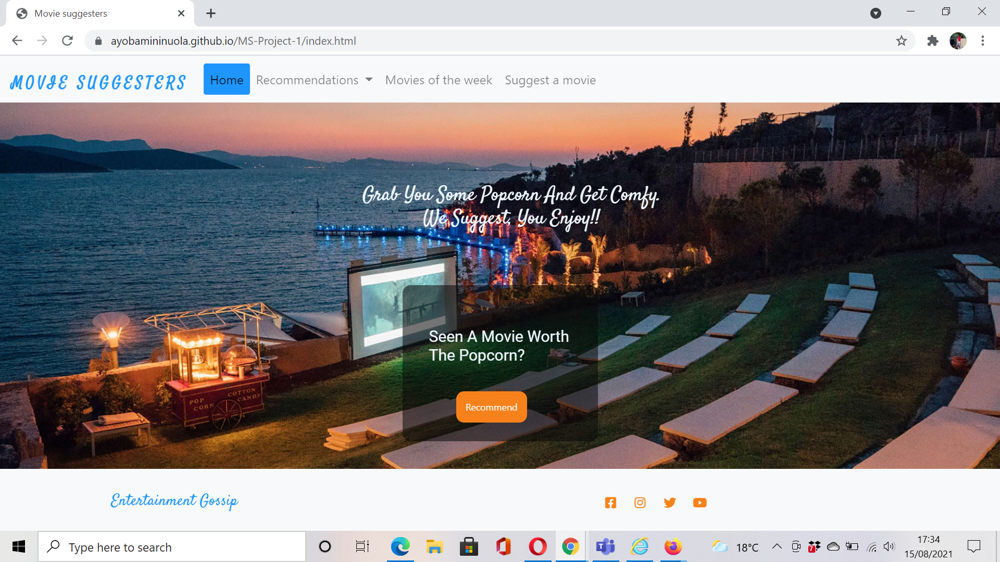

# MILESTONE PROJECT ONE
 

## TABLE OF CONTENT
* Title
* Introduction
* Technologies
* Set-up
* Deployment  

## Title
 Movie Suggesters

## Introduction
 Movie suggesters is a website designed to recommend movies for movie lovers and suggest where it can be watched. It also enables users to recommend movies that they think is worth watching for others.

## User Experience

### Ideal users of the website are:
1. Potential movie lovers
2. 

### Project Goals
 The aim of creating this website is to make it easier for movie lovers to see recommended movies and make the choice of what to watch and where by picking movies that are suggested as worth-watching movies by other movie lovers.

#### Users' Goals
1. To see suggested movies in a less distracting site.
2. To read and know something about the suggested movie in order to decide if it's worth watching.
3. To recommend movies for others.
4. To be able to see movies arranged and grouped.

#### Developer's Goals
1. To make a website where movie lovers can see some suggested movies and not waste time searching through hundreds of movies without knowing which is worth watching.
2. To logically group the movies based on where to watch and the category of the movie.
3. To minimize dissapointment of blindly watching a movie on a movie App that can later be said to be a waste of time and effort.
4. To give users the opportunity to recommend movies that they have seen and would love others to see as well.
5. To make users feel as part of the website community by giving them the opportunity to recommend movies for others to watch.   

### First time user Goals
* As a first time user, I want to be able to understand the purpose of the website at a glance.
* As a first time user, I want to be able to navigate through the site with ease.
* As a first time user, I want to be able to make recommendations easily without typing too much.
* I want to be able to contact or follow the site owner on social media for any questions or update. 

### Returning Visitor Goals
* As a returning user, I want to be able to see new movie suggestions weekly on site.
* I want to be able to recommend movies and be able to ask how my recommendations are used.
* As a returning user, I want to be able to watch suggested movies of the week trailers

 ## Design Choices
 - The site is made for movie lovers to easily see few suggested movies that can be watch at their leisure time. The design choice is made putting in mind that a movie settings is expected to be cool.

 **Background-colours:**
* Background colors are choosen to be dark and cool to give the users a welcomimg cinematic feel that also feels calm and relaxing setting the mode for some movie time.
 
 **Font:**
* The fonts used are Roboto and Satisfy to give the site artistic feel and also balancing it up to ensure it's legible and easy to read. The font-weight and sizes also ensures users are able to read contents easily.

 **Styling:**
* Most Boxes and containers have round edges which make them more attractive and eye catching without distracting attention from the main content.

 **Video files:**
* Videos were given controls to enable users to play, pause and mute the video if needed with little description added to card.

 **Form:**
* Form was designed with a transparent container on a pictorial background to make it attractive and interesting to use. In order to enable users to use it witout stress and wasting time as well, it was designed to type less and check/click more thus saving time.

 **Icons:**
* All icons used are straight forward and not in any way misleading or confusing.       
 
## Wireframing
* The wireframe was created using Figma.[Wireframe](https://www.figma.com/file/xNpRfVbEvIAkqscHt548B1/Movie-Suggesters?node-id=0%3A1)

## Technologies Used

### Languages Used
1. HTML5
2. CSS3

### Frameworks, Libraries & Programs Used
1. [Bootstrap 4.6.x](https://getbootstrap.com/docs/4.6/getting-started/introduction/):
    Bootstrap was used for responsiveness of the site and some advanced coding

2. Hover.css:
 Hover.css was used on Social media footer icon to have a transition effect when hovered over

3. [Font Awesome](https://fontawesome.com/):
    Font awesome was used to import icons used for social media on all pages.

4. [Google Fonts](https://fonts.google.com/):
    Google Fonts was used to import "Roboto and Satisfy" font family into style.css which were used throughout the project     

5. [Javascript](https://getbootstrap.com/docs/4.6/getting-started/javascript/):
    Javascript was used as part of Bootstrap to make Navabar toogler used on all pages as well ad scrollspy used on recommendations pages

6. [Git](https://gitpod.io/workspaces):
    Git was used for version control to push and commit to Github

7. [GitHub](https://github.com/):
    GitHub is used to store the project code

8. [Tinypng](https://tinypng.com/):
    Tinypng was used to compress images used throughout the project

9. [Pexels](https://www.pexels.com/):
    Free and high resolution images downloaded from the site were used in the project.

10. Wiki:
    Other images used in the project were from wiki site with sources referenced in the project.              

11. [HD-trailers](http://www.hd-trailers.net/):
    All videos used in the project were dwonloaded from the above site free.
    
12. Figma:
    Figma was used to create Wifeframes for the project. See here:
* [Homepage Wireframe](https://www.figma.com/file/8BlnyDyJlrUp4Q340kZx5D/Home-Page?node-id=0%3A1)
* [Recommendations page Wireframe](https://www.figma.com/file/zW4lBzVaeicYauV5non2aj/Recommendation-page?node-id=0%3A1)
* [Movies of the week Wireframe](https://www.figma.com/file/j3KvF6XbDaCBKP6VMacxzL/Movies-of-the-week?node-id=0%3A1)
* [Form Wireframe](https://www.figma.com/file/nNciNsMGEe0kidD0gCGEQm/Form?node-id=0%3A1)

# Testing

* W3C Markup Validation Service
* W3C CSS Validation Service
 The W3C Markup Validator and W3C CSS Validator Services were used to validate every page of the project to ensure there were no syntax errors in the project.
 
### CSS Validation

### Home page html validation

### Recommendation page validation

## Testing User Stories from User Experience (UX) Section
### First time visitor goals
1. As a first time user, I want to be able to understand the purpose of the website at a glance.
    * Upon opening the site, the user is welcomed by a captivating background image which is an outdoor cinema with  heading plain on the image telling first time users what we do.
    * On the Navigation bar are lists of instructions telling the user what each pages will do once clicked.
    * Also on the background that user will see first is a box telling users to make recommendations with a call to action button
    * At the foot of the page are social media links with icons ease in once hover over to captivate users.

2. As a first time user, I want to be able to navigate through the site with ease.
    * On the top of the page upon entry are links that directly informed users what each pages do and contents that might be found in them.
    * The Navigation bar is fixed thereby making it easier for users to see the links at all times and not feel trapped and the need to scroll all through to the top before they can leave current page
    * On the recommendation page which is a long page, smaller links is made available at start of each section just making users a click away from other sections 
    * The foot of the page has links that takes the user outside the window they are working and this is made so users can return to the site without having to search again.

3. As a first time user, I want to be able to make recommendations easily without typing too much.
    * Upon entry, there is a call to action button visibly placed on the background image asking users to make recommendations. This button leads to a page where there is a form to be filled.
    * The form is designed to make it easier for users to recommend easily by just typing in one field and clicking to fill others.
    * After filling the required field in the form and the submit button is clicked, the page is refreshed and the user can use the navigation links to go to any other desired page.

4. I want to be able to contact or follow the site owner on social media for any questions or update.
    * At the foot of all pages is a list of social media icons that lead the user to the social media page of the site

### Returning Visitor Goals
1. As a returning user, I want to be able to see new movie suggestions weekly on site.
    * On returning to the page, the user can go to the movies of the week page by clicking on the navigation link and it will take the user to the weekly edited page of the website.

2. I want to be able to recommend movies and be able to ask how my recommendations are used.
    * The home page has a little captivating box which asks users if they would love to recommend a movie. This is visibly and neatly placed on the home page and the same button when clicked leads to a form for recommendation.
    * On every page is a link that useers can click to display a recommendation form to suggest movies for others. The form is made simply, easy and quick to fill.

3. As a returning user, I want to be able to watch suggested movies of the week trailers.
    * On all pages is a link that leads users to the page where suggested movies for that week are.
    * Each movie trailers have controls that enables users to play and pause the movie trailers. 

## Further Testing
 * The website was tested on Google Chrome, Microsoft Edge, Opera, Internet Explorer and Safari Browsers
 * The website was tested on all browsers using different devices; Laptop, Tablets, Androids(Samsung S10+, Samsung S20), iphone7 and iPhoneX.
 * Friends and families were asked to check the website on various devices with different browsers to ensure all links are functioning well.

 
### Browser Validation
#### Chrome Browser

#### Microsoft Edge

#### Opera Browser

#### Firefox Browser

#### Internet Browser

### Lighthouse Auditing
- Home Page - [test image](assets/images/Home-page.png)
- Recommendation Page - [test image](assets/images/recommendation.png)
- Movies of the week Page - [test image](assets/images/movies_of_the_week.png)
- Suggest Page - [test image](assets/images/suggest.png)

